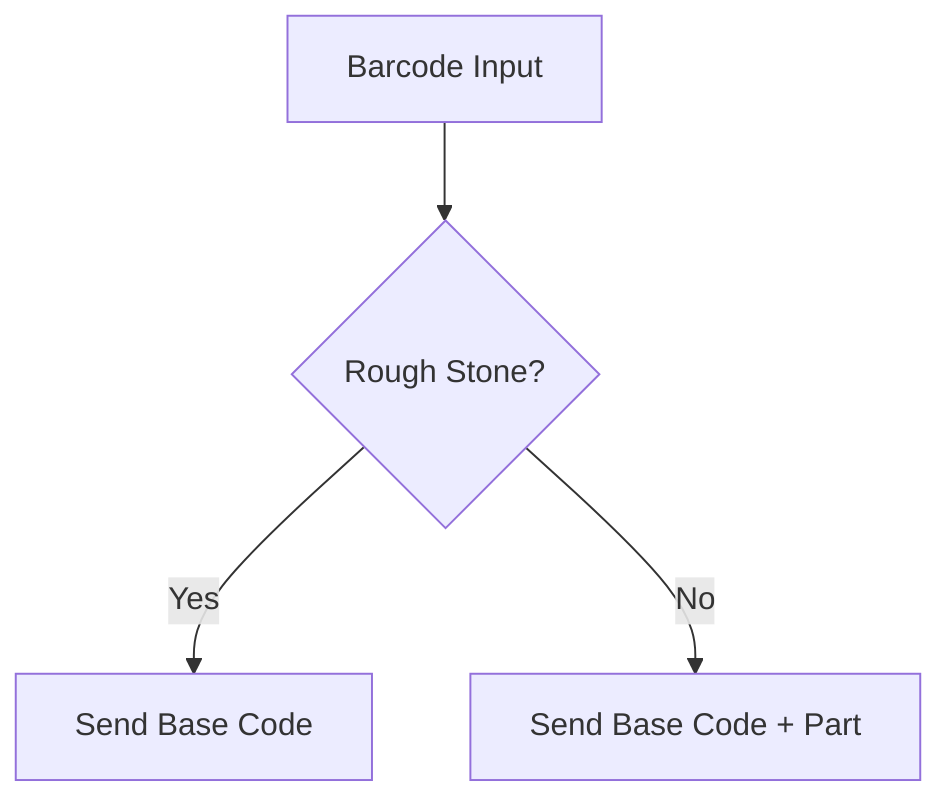

import { Form } from "/snippets/form.mdx";

## Overview

The **barcode to stone ID conversion** ensures that each stone is uniquely and accurately identified before being sent to the vendor’s API.  

- **Rough stones** → Send only the base code (e.g., `ABCD`).  
- **Split/Polished stones** → Append the part suffix (e.g., `.1`, `.2`) to indicate the derived stone.  

---

## Flow



---

## API Reference

### Endpoint

```http
GET https://example.com/your-end-point?barcode={barcode}
```

### Headers (if any)

```http
Authorization: Bearer <your-api-token>
Accept: application/json
Content-Type: application/json
```

### Request Example

```http
GET https://example.com/your-end-point?barcode=165165165
Authorization: Bearer sk_test_123456
Accept: application/json
Content-Type: application/json
```

### Successful Response

```json
{
  "stoneId": "ABCD.1"
}
```

### Error Response

```json
{
  "error": "Invalid barcode or stone not found"
}
```

---

## Integration Notes
- **Rough stones** return only the base (e.g., `ABCD`).  
- **Split stones** return the part suffix (e.g., `ABCD.1`, `ABCD.2`).  

---
If you have any queries, please submit a ticket using the form below:

## 🛠️ Support
<Form />

