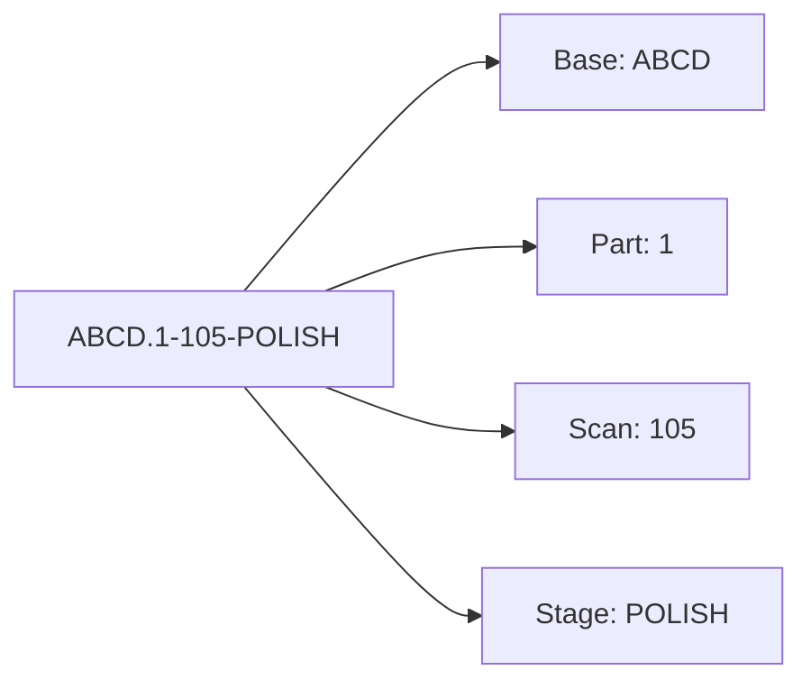

## 🔍 Understanding the Stone Code Format

Each diamond stone is assigned a structured identifier that captures critical information across its journey—from rough to polish. Here's an example code:

### Visual Mapping

### Breakdown Table

| **Component**      | **Value** | **Description**                               |
| ------------------ | --------- | --------------------------------------------- |
| 🧱 **Base Code**   | `ABCD`    | Unique identifier for the primary stone batch |
| ✂️ **Part**        | `1`       | Indicates this is a sub-part of the original  |
| 🔎 **Scan Number** | `105`     | Scan session or tracking reference            |
| 🛠️ **Stage**       | `POLISH`  | Current processing stage                      |

import { Form } from "/snippets/form.mdx";

## 🧪 Stone Verification Tool

Use our interactive tool to verify your diamond stones instantly via API.

<Form />

---
